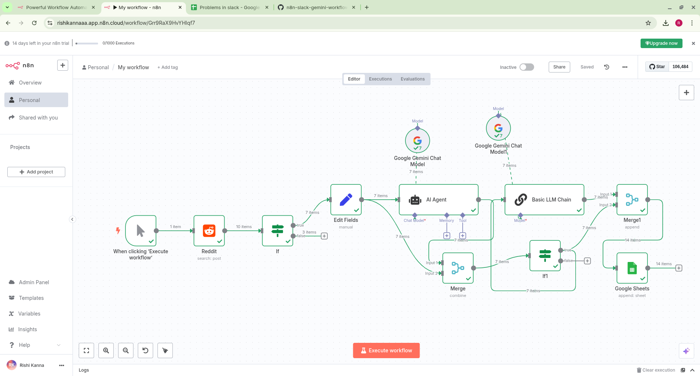

# 🤖 Reddit → Gemini AI → Slack Automation using n8n


This repository contains a powerful automation built using [n8n.io](https://n8n.io). It connects Reddit, Google Gemini (AI model), and Slack to automate social listening and intelligent response delivery.

---

## 🚀 What It Does

- 🔍 Monitors Reddit for posts with specific keywords
- 🧠 Sends content to Google Gemini (chat model)
- 💬 Posts the AI-generated response to a Slack channel
- 🔄 Fully customizable and extendable!

---

## 🖼️ Workflow Overview

This screenshot shows the n8n workflow that monitors Reddit, processes content using Google Gemini, and sends AI replies to Slack:

<p align="center">
  
</p>

---

## 📂 Files

| File                   | Description                                      |
|------------------------|--------------------------------------------------|
| `workflow.json`        | Importable n8n workflow file                     |
| `workflow-preview.png` | Screenshot of the workflow for visual reference |
| `.gitignore`           | Common ignore rules for GitHub repo             |
| `README.md`            | Full documentation and usage guide              |

---

## 📥 How to Use

### 1. Clone the Repository

```bash
git clone https://github.com/rishikannaaa/n8n-ai-slack-workflow.git
cd n8n-ai-slack-workflow
